# Annotator

## Home
At Home page, choose Labeler role and your screen will be something like this

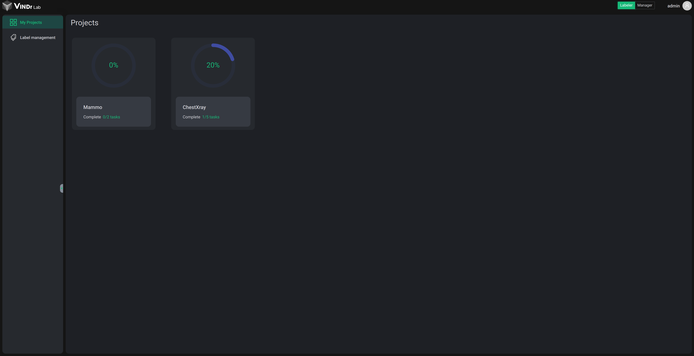

The Home page contains a list of projects that you are added as an annotator. Each project is represented as a card which show general informations such as:

- Project name
- Task progress

Click any card to jump into a project.

## Project page

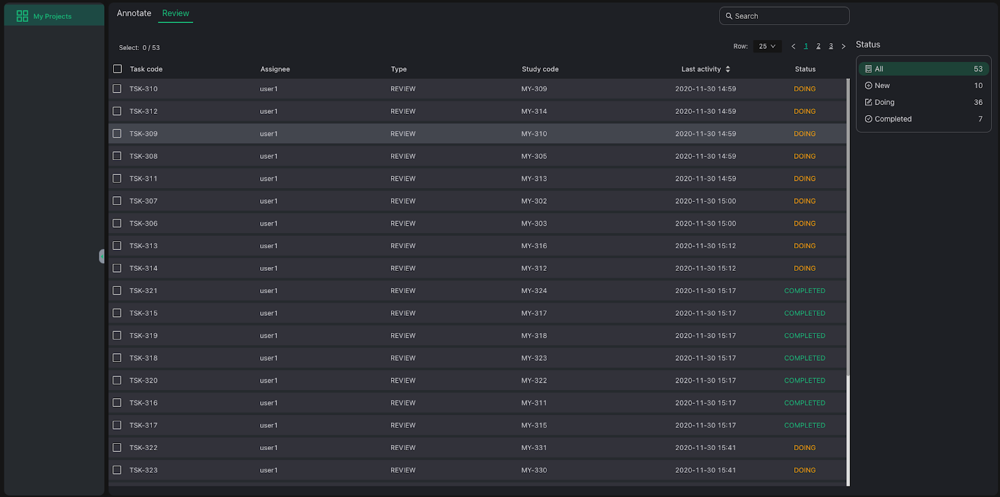

The Project page contains:

- Project name at top
- Annotate/Review tab
- Search bar
- Task List
- Task Stat

### Annotate or Review

At VinDr Lab’s workflow, a task could be an opened or closed blind reading.

- An open reading (Review) means that you could view (and copy) other task annotations on the same study that the task is associated with.
- A closed reading (Annotate) means that you and others read independently.

Depending on the project’s owner, you as an annotator are assigned as an reviewer or annotator. Check both tabs to find out your task list.

***Note**: Reviewer’s annotations are considered as the final annotation for completed studies.*

### Task list

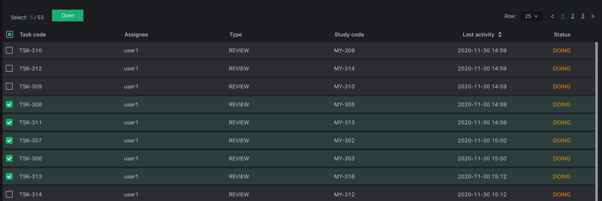

This list helps you manage your tasks in pages. Each row is a task with the following information:

- Task code: VinDr Lab generates code for new tasks when it is created.
- Assignee: Who is assigned to current task (Most of the time, it’s you)
- Type: Task reading type (ANNOTATE or REVIEW)
- Study code: VinDr Lab generates a code for new study when it is uploaded.
- Last activity: Last time the task is modified by you or admin (annotating, re-assign, assign)
- Status: Task’s status (New, Doing or Completed)

From here, you can select multiple studies and open them to jump into the VinDr Lab viewer (for your work session). You can open it by clicking the top “Open” button or right click to show the menu option.

### Tast stat

This section help you:

- Keep track of the number of tasks with different status.
- Filter the Task list by clicking on a status.

### Search

VinDr Lab’s search leverage Elasticsearch for our advanced search on Task code, Study code, Status. The syntax is the same for common usages:

- Regexp query
- Wildcard query

## VinDr Lab Viewer

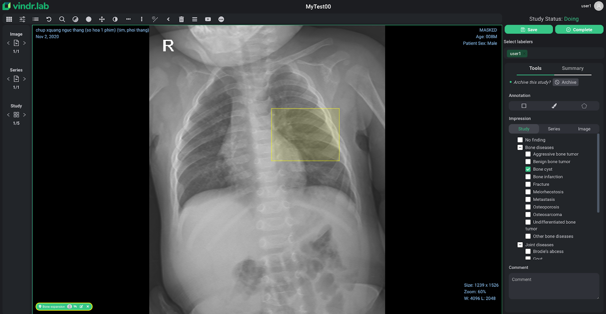

Let’s take a glance at our viewer !

Viewer main components:

- Viewport
- Toolbar
- Navigator
- Labeling tools
- Labeling tags

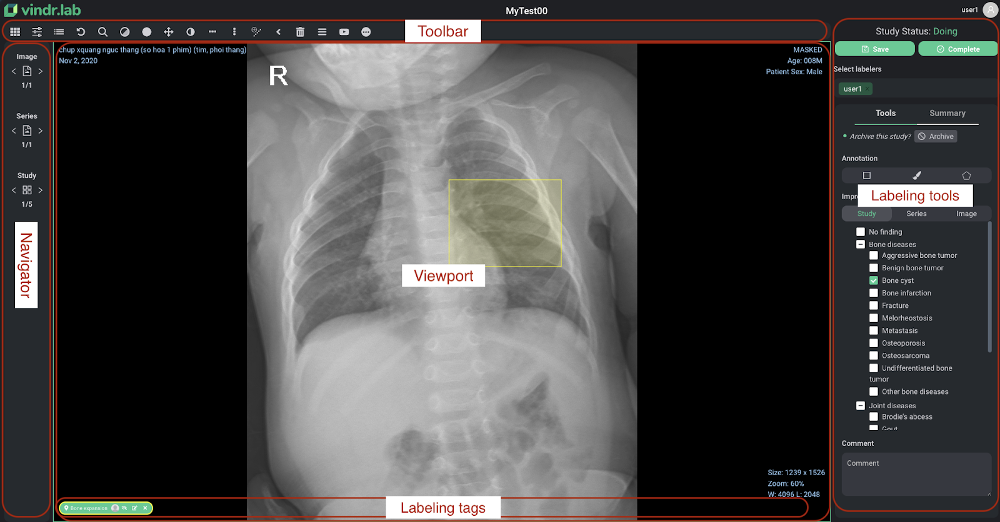

### Navigator

Each (multiple or single) opening from the Task list will create a session. The Navigator is used to navigate between different tasks in a session, series in a task, images in a series.

Study | Series | Image 
:-------------------------:|:-------------------------:|:-------------------------:
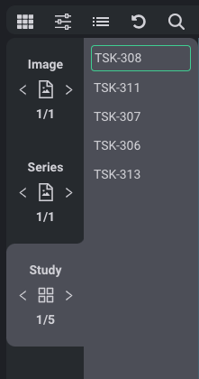  |  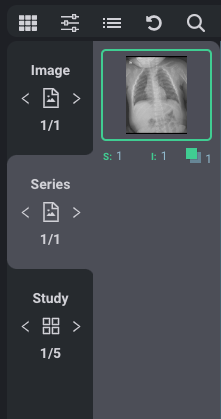  |  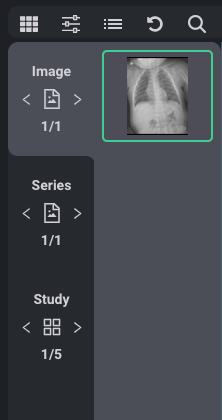

### Toolbar

A collection of medical imaging tools is optimized for viewing while labeling with VinDr Lab.

### Labeling tools

#### Task progress

Top of the Labeling tools panel is a combination of task relevant tools:

- Study Status: show status of current task
- Save: save current state of labeling work
- Complete: mark current task as completed. Once the task is completed, you cannot undo unless admin re-assign the task.
- Select labelers: if you are a reviewer, you can select who to view their annotation here.

#### Tools Tab

This is the main toolset for labeling. Normally, the user interface shows all the available tools with respect to project type.

Currently, VinDr Lab support drawing tools for 2 type of Project:

- 2D
    - Polygon: Segmentation problem.
    - Brush: Segmentation problem.
    - Bounding box: Detection problem.
- 3D (To be updated)
    - Series of bonding boxes: VinDr Lab follows the keyframe concept, all drawn bounding boxes are called keyframe and the other is interpolated after finish drawing.

Besides, VinDr Lab supports Impression (Global) tool for tagging to label classification problems. This type of label is organized by scope (study, series, image) and family (root, child).

Lastly, there is a Comment box at the bottom in case you want to leave any comment for the Doing task.

Tool2D | Tool3D | Tool3D 
:-------------------------:|:-------------------------:|:-------------------------:
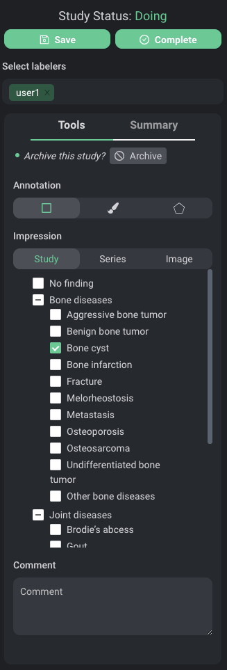  |  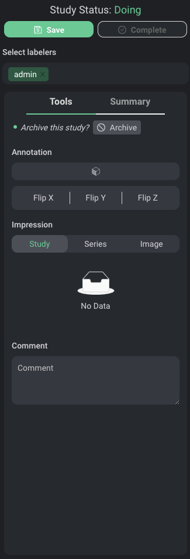  |  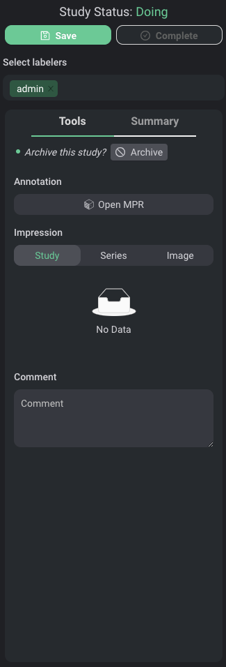

#### Summary tab

This tab shows you an overview of annotation and tag you labeled.

As a reviewer, you could do the following things:

- Select multiple labelers to view.
- Copy all annotations from selected labelers (except your own annotations) to make them your own and edit as usual.

### Labeling annotation on Viewport

Viewport is the module that displays the image and where you draw different types of annotation here.

After activating the desired tool on the Labeling annotation tools panel, you draw any annotation on the Viewport region and a dialog called “Assign Label” will pop-up. VinDr Lab introduces an additional tool for tagging the annotation with a list of label names and description. Finally, you click Submit to confirm or Cancel to terminate the annotating.

### Labeling tags

The Labeling tags section manages all annotated labels that you have drawn on Viewport. Move between these tags to review your annotation. You could also hide, edit or delete annotation here.

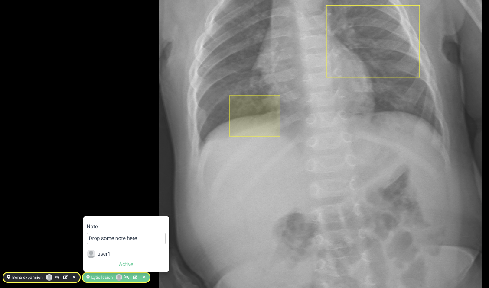

&nbsp;