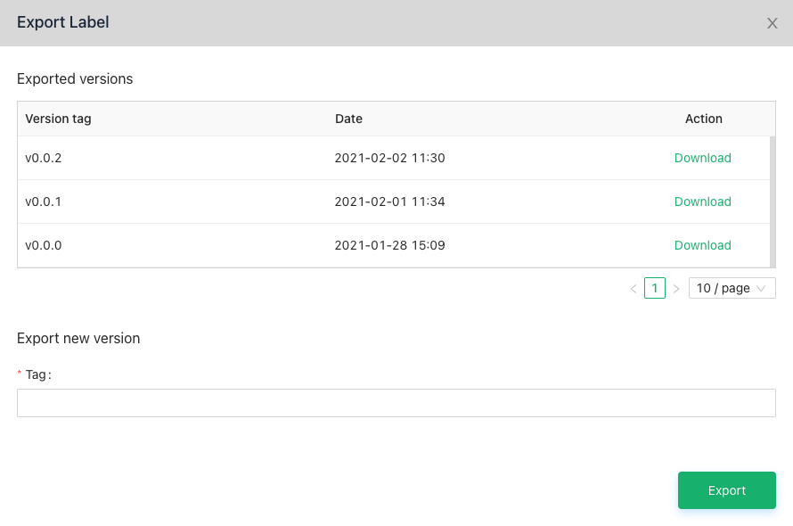

# Label data

## Export

From the Data tab in your project page, click Export Label.

VinDr Lab exports annotations and tags from all Completed study which were labeled by Reviewers.

VinDr Lab saves all exported files for management. Each version is defined by a Tag that you give it.



## JSON Format

VinDr Lab exports all annotations and tags in a JSON format file.

```
exported_labels = {
 "label_groups" : [ str ], // list of label used in exported project
 "objects" : [ object ], // list of object in exported project
 "labels" : [ label ], // list of label in exported project
 "impression" : [ annotation(tag) ], // global tag label
 "finding" : [ annotation(!tag) ], // local label
 "comments" : [ comment ],
 "archives" : [ str ], // object_id list
 "studies" : [ study_info ]
}
```

Notation: To be updated ...

&nbsp;