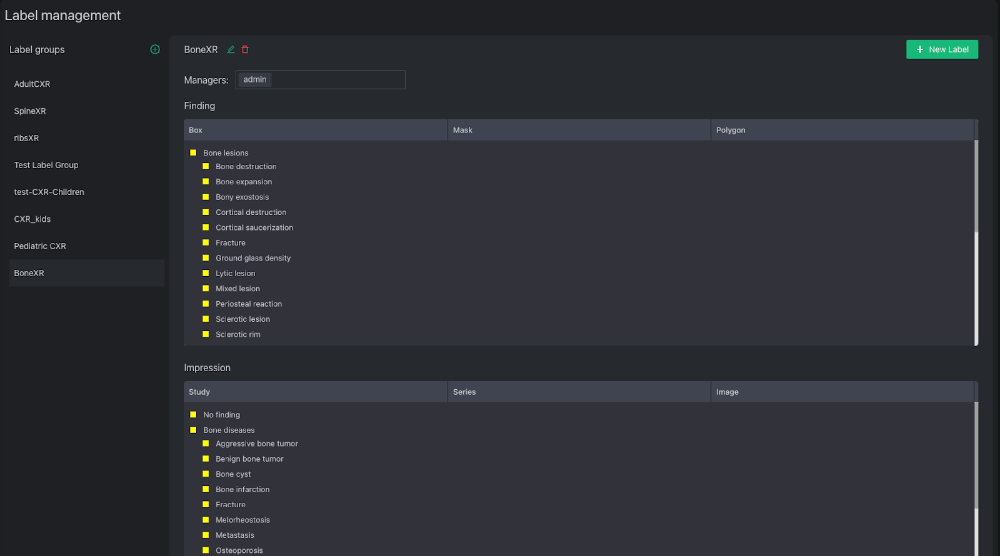

# Labels

## Label group

VinDr Lab introduces a Label group feature to share and reuse a group of labels.

Accessing Label management page from Home page and you will see something like this:

In this page, you can

- Add a new group (click “plus in circle” icon next to “Label groups”)
- Edit a group
    - Rename.
    - Delete.
    - Add or remove label managers who have full access to the assigned group.
- Manage label
    - Add new label
    - Reorder label (which order that annotator will view)

## Label management

### Create new label

{: style="width:80%"}

A Label requires:

- Type: Impression (Global: tag) or Finding (Local: annotation such as bounding box)
- Scope: Study, Series, Image (apply to impression label)
- Name, Short Name & Description:
    - Name is required to display the label.
    - Short Name is redundant (it will replace Name soon to display label).
    - Description is the value for the tooltip when holding the mouse through the label name.
- Label Family: Left these options as default if you do not know what it is.
    - Family type: If this label has children, what type of choice for all of its children, single choice or multiple choice ? Default value: Multiple choices.
    - Parent Label: If this label is a child of a label, which one is its parent ? Please choose the one that you have already created before.
- Color: color for text and annotation on viewport.

## Import label from CSV

To be updated ...

## Export label to CSV

To be updated ...

&nbsp;