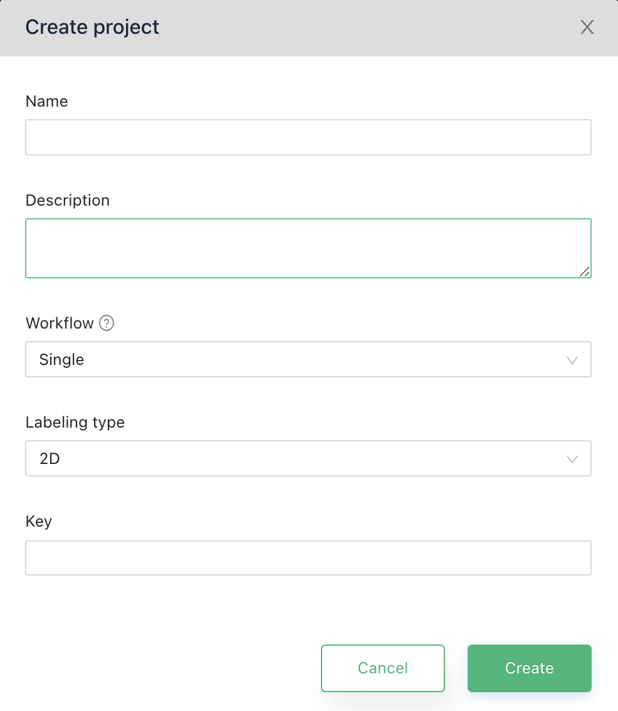
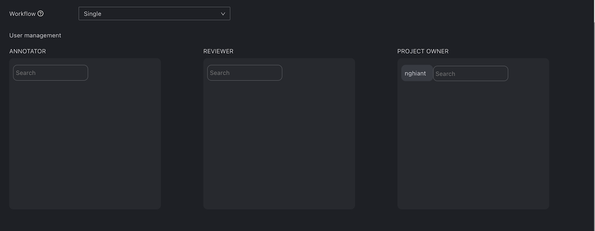
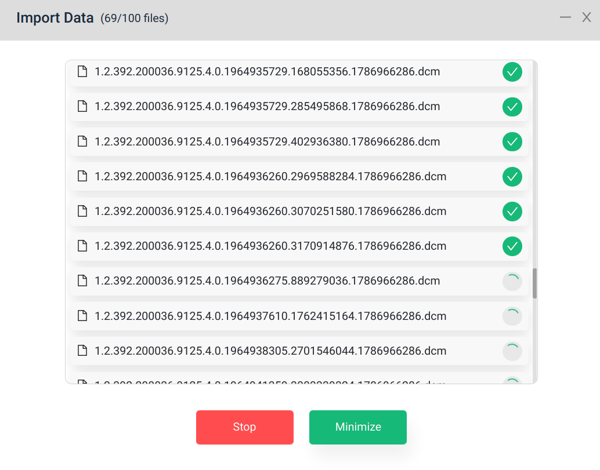
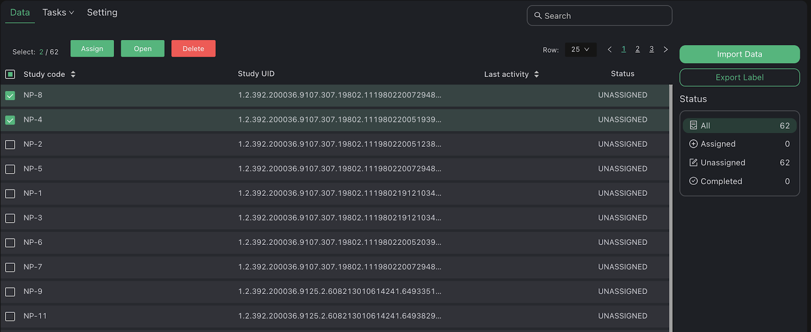
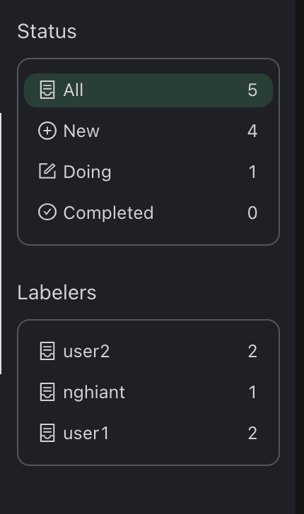

# Projects

At Home page:

- Left menu navigate you through two main management sector
    
    - My Projects: An overview of your project as Labeler (which project you are assigned) or Manager (which project you are owner).
    - Label management: Where you create, organize and share your labels.
    - Role switch: You can use this to switch between Manager and Labeler view
    

## Create project

To create a new project, click the “Plus in circle” button next to “Projects”.

{: style="width:40%"}

A Project creation requires:

- Name: Project’s name.
- Description: Text describes the project.
- Workflow: Currently, VinDr Lab support two kinds of labeling workflow
    - Single (default): A single study required at least 1 person to read.
    - Triangle: A single study required at at least 2 annotators and 1 reviewer.
- Labeling type: VinDr Lab support two type of project
    - 2D: annotate on a single image.
    - 3D: annotate on multiple images as a whole.
- Key: A short code represents project identity. When you upload your data into this project, each study will have a Study Code with a prefix that starts with Key. (For example, if your project key is ST, study code will be like ST-1, ST-2, etc)

## Project setup

Right after clicking Create in Create Project dialog, you will be navigated to the Project Setting page where you make the first setup and modify it later.
At Project Setting page, you are interested in 3 sections:

### Project info 

This section includes:

- Project Name
- Labeling Instruction
- Labeling type
- Delete Project

### Label selector 

- You can choose between available label groups or create a new one quickly. After select a group, there is a section below help you manage your group (same as Label management page)

### Project workflow

You can modify the workflow that you have chosen before at this page. Depending on the workflow, you will assign for each study a number of Annotate and Review tasks. This setting helps you prepare a pool of labelers to select as Annotator or Reviewer later. You also can add more users as Project Owner.

And do not forget to click Save after changing these settings.

## Import data

VinDr Lab supports two methods to upload your data manually:
- Select File: upload multiple files
- Select Folder: upload a single folder that contains data (maybe nested folder)

You can click the buttons or drag & drop data here and then click Start Upload.

Before select            |  After select
:-------------------------:|:-------------------------:
  |  

In the uploading process, you can monitor upload status and minimize the dialog to continue other work. After uploading ends, you can export logs to filter out error studies.

Uploading            |  Finish upload
:-------------------------:|:-------------------------:
  |  

## Project management

Beside Setting, there are two other management tabs which are Data and Tasks.

- Data: manage all study in current project 
- Tasks: manage all assigned tasks in the project.

### Data management

#### Study list

Study lists organize your data as the unit of study case by StudyInstanceUID in dicoms. Each row is a study with the following information:

- Study code: VinDr Lab generates a code for new study when it is uploaded. Its prefix is the Key of the project.
- Study UID: Original StudyInstanceUID in dicom metadata. 
- Last activity: Last time the study is modified.
- Status: Study’s status (Unassigned, Assigned or Completed)

From here, you can select multiple studies and there are 3 types of action on the top of list (right click also work here)

- Open study to jump into the VinDr Lab viewer.
- Assign to create new tasks.
- Delete to delete study from the project.

#### Data stat

{: style="width:30%"}

This section help you:

- Keep track of the number of studies by different status.
- Keep track of the number of annotations, tag for each label.
- Filter study by status.

### Task management

#### Task list

As a manager, this list helps you manage all the tasks that you assigned to other members . Each row is a task with the following information:

- Task code: VinDr Lab generates code for new tasks when it is created.
- Assignee: Who is assigned to a current task.
- Type: Task reading type (ANNOTATE or REVIEW)
- Study code: VinDr Lab generates a code for new study when it is uploaded.
- Last activity: Last time the task is modified by labeler or admin (annotating, re-assign, assign)
- Status: Task’s status (New, Doing or Completed)

From here, you can select multiple tasks and there are 3 types of action on the top of list (right click also work here)

- Open tasks to jump into VinDr Lab viewer (view assignee’s task).
- Re-assign to change task status from Doing/Completed to New.
- Un-assign to revoke New task.

#### Task stat

{: style="width:30%"}

This section help you:

- Keep track of the number of tasks with different status, labels.
- Filter the Task list by clicking on a status or a labeler.

## Assignment

From Study list, clicking Assign navigate you to the Assignment interface

- Study Pool: A set of studies from that will be assigned to different labelers. There are 3 sources:
    - Selected studies: Set of studies that you selected before from the Study list.
    - Search condition: Set of studies filtered by condition from Study list.
        - In this case, you can enter the number of studies to randomly sample from search conditions.
    - Study UIDs file: List of StudyInstanceUID (please make sure that these study already existed on the system)
- Labeler Pool: A set of labelers for different task type
    - Annotator: Set of labelers for Annotate task
    - Reviewer: Set of labelers for Review task
- Assignment Strategy:
    - All: Each person in the Labeler Pool is assigned all study in the Study Pool.
    - Equal: Divide equally the number of study in Study Pool for user in Labeler Pool

&nbsp;