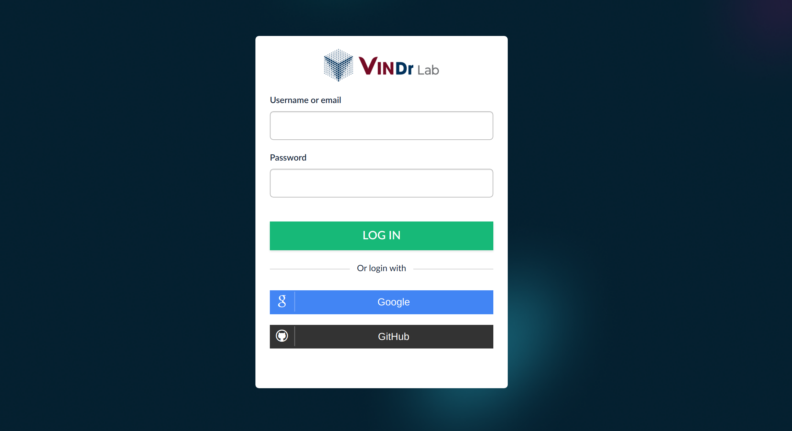

# Sign-in

Currently, there are 2 ways to sign in:

- Normal sign-in: You could only logged in with an available account. (requested)
- 3rd provider: You will logged in as an annotator without any assigned project. Then you need to request permission for further features.

&nbsp;