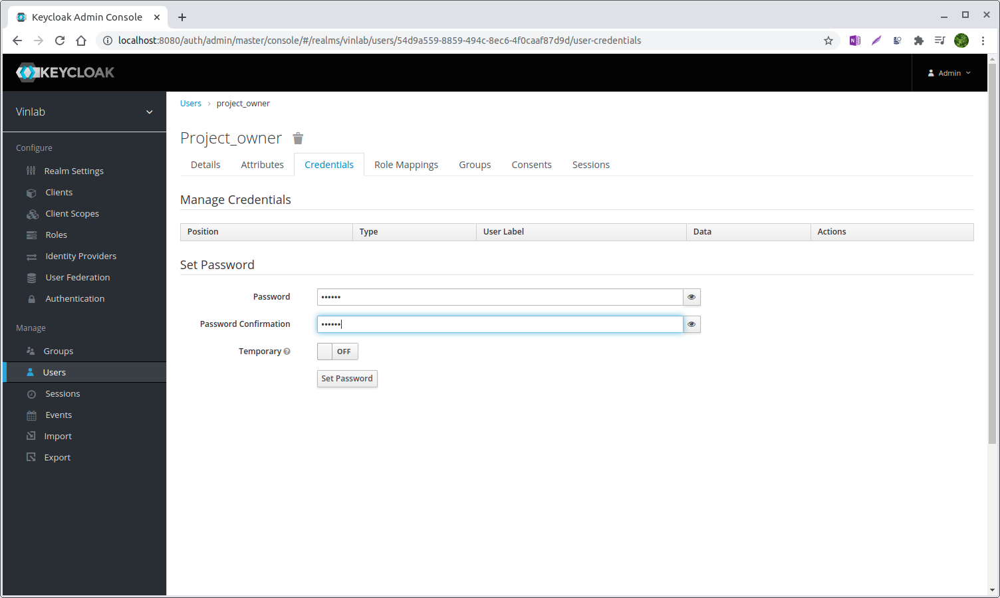
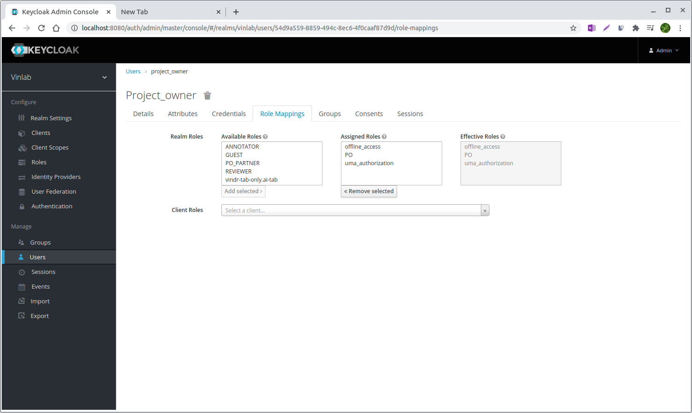

# User management

## Intro to KeyCloack

Normally, the default location for Keycloak is <ins>https://your_web_address/auth.</ins>

Click Administration Console, to go to the Master realm login creen.

In the Master realm login screen, user admin username and password. 
We provide default account is admin / admin

## Create new user

To create a new user, go in to the Users section by clicking the Users in the left menu.

Then click Add user button

After creating a new username, turn to the Credentials tab, set your password.

## User role mappings

There are 5 pre-defined roles in VinDr Lab with their following permissions

| RESOURCES     | PO   | ANNOTATOR | REVIEWER | PO_PARTNER | GUEST |
|---------------|------|-----------|----------|------------|-------|
| accounts      | R    | R         | R        | R          | R     |
| annotations   | R    | CRUD      | CRUD     | R          | R     |
| labels        | CRUD | R         | R        | CRUD       | R     |
| label_groups  | CRUD |           |          | CRU        |       |
| projects      | CRU  | R         | R        | R          | R     |
| tasks         | CRUD | RU        | RU       | CRUD       | R     |
| objects       | CR   | R         | R        | CR         | R     |
| stats         | R    | R         | R        | R          | R     |
| sessions      | CR   | CR        | CR       | CR         | CR    |
| studies       | CRUD | R         | R        | RUD        | R     |
| label_exports | CR   |           |          | R          |       |

To change the role of an user, go to Role Mappings tab, the assign desired role to the account

&nbsp;